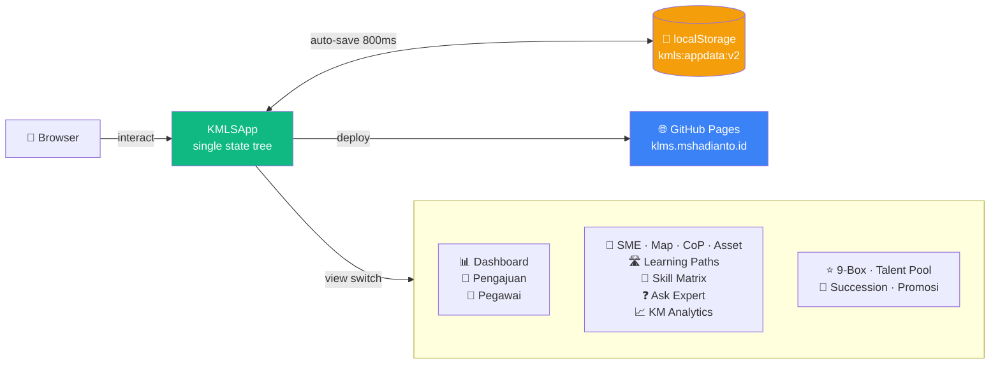
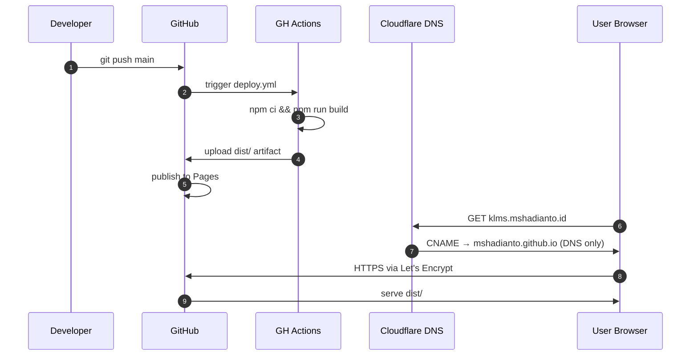

<div align="center">

# 🎓 KMLS

### Knowledge Management & Learning System

**Prototipe modern KMS terintegrasi — 4 pilar KM + Talent Management + Learning Paths + Skill Matrix + Q&A Expert + Analytics dalam satu aplikasi React.**

[](https://klms.mshadianto.id/)
[](https://github.com/mshadianto/klms/actions)
[](#-disclaimer)

[](https://react.dev)
[](https://vitejs.dev)
[](https://tailwindcss.com)
[](https://lucide.dev)
[](#-license--credits)

[**🚀 Try Live Demo**](https://klms.mshadianto.id/) ·
[**📖 Architecture**](./CLAUDE.md) ·
[**🐛 Report Issue**](https://github.com/mshadianto/klms/issues) ·
[**👨‍💻 Developer**](https://github.com/mshadianto)

</div>

---

> ## ⚠️ Disclaimer
>
> KMLS adalah **inisiasi personal** [MS Hadianto](https://github.com/mshadianto) sebagai prototipe konsep Knowledge Management System.
>
> 🚫 **BUKAN aplikasi resmi Badan Pengelola Keuangan Haji (BPKH)** — tidak merepresentasikan posisi, kebijakan, atau sistem informasi lembaga.
>
> Seluruh nama pegawai, divisi, data pelatihan, dan dokumen yang ditampilkan bersifat **fiktif / dummy** untuk keperluan demo dan eksplorasi konsep semata. Aplikasi belum melalui audit keamanan formal — jangan input data sensitif atau rahasia jabatan.

---

## ✨ Highlights

<table>
<tr>
<td width="50%" valign="top">

### 🧠 Modern KMS Core
- **Asset Lifecycle** — Draft → Review → Published → Archived
- **Versioning + Review Date** dengan banner overdue
- **Ratings & Bookmarks** per user
- **Threaded Comments** di setiap asset
- **Knowledge Graph** — auto-detect SME/CoP/Path terkait

</td>
<td width="50%" valign="top">

### 🔍 Discovery & Learning
- **Global Search** lintas entity (asset, SME, pegawai, CoP, path, Q&A)
- **Learning Paths** — kurikulum step-by-step + enrollment tracking
- **Skill Matrix** — pegawai × kompetensi + auto gap analysis
- **Ask the Expert** — Q&A auto-routed ke SME by domain
- **Promote-to-Asset** — jawaban terbaik jadi Knowledge Asset baru

</td>
</tr>
<tr>
<td width="50%" valign="top">

### 📊 KM Intelligence
- **Health Score 0–100** — published × fresh × up-to-date
- **Dormant Detection** — asset tidak dibuka >90 hari
- **Top Contributors** leaderboard
- **Trending & Tag Cloud**
- **Knowledge Harvesting** dari pelatihan selesai → auto Lessons Learned

</td>
<td width="50%" valign="top">

### 👥 Talent Management
- **9-Box Mapping** — kinerja × kompetensi
- **Talent Pool** — Star / HighPot / Future / Critical
- **Succession Plan** untuk posisi kritis
- **Workflow Promosi** dengan cek syarat otomatis
- **End-to-end Pengajuan Pelatihan** workflow

</td>
</tr>
</table>

## 🚀 Quick Start

```bash
git clone https://github.com/mshadianto/klms.git
cd klms
npm install
npm run dev          # http://localhost:5173
```

Build untuk production:

```bash
npm run build        # output → dist/
npm run preview      # preview build hasil
```

## 🏗️ Architecture



**Single state tree** (`data`) di `KMLSApp` → modul terima `onUpdate(newData)` → auto-save ke `localStorage` setelah 800ms debounce. Tidak ada backend, tidak ada router, tidak ada reducer — semua React state biasa. Lihat [`CLAUDE.md`](./CLAUDE.md) untuk detail arsitektur per-modul.

## 📦 Modul Lengkap

<details>
<summary><b>🔓 Click to expand full module list</b></summary>

### Core
| Modul | Deskripsi |
|---|---|
| **Dashboard** | Ringkasan eksekutif: pengajuan, biaya, asset, SME, CoP engagement |
| **Pengajuan Pelatihan** | Workflow draft → pending → review → approved → completed, dengan **Knowledge Harvest CTA** otomatis pada pelatihan selesai |
| **Direktori Pegawai** | Daftar pegawai + riwayat pengembangan + profil SME/Talent |
| **Pengaturan** | Backup JSON · Reset ke seed |

### Knowledge Management (4 Pilar + Extended)
| Modul | Deskripsi |
|---|---|
| **SME Development** | Pengembangan Subject Matter Expert per domain keahlian |
| **Knowledge Map** | Pemetaan domain pengetahuan + identifikasi gap (matang / berkembang / gap) |
| **Community of Practice** | Komunitas pembelajar dengan engagement tracking |
| **Knowledge Asset** | Repositori dengan **lifecycle**, **versioning**, **ratings**, **bookmarks**, **comments**, dan **Knowledge Graph view** |
| **Learning Paths** | Kurikulum step-by-step (asset + training) dengan enrollment per user + progress |
| **Skill Matrix** | Pegawai × kompetensi grid + auto **gap analysis** vs role requirement |
| **Ask the Expert** | Q&A dengan auto-routing ke SME by domain · voting · promote-to-asset |
| **KM Analytics** | Health score · dormant detection · top contributors · trending · tag cloud |

### Talent Management System
| Modul | Deskripsi |
|---|---|
| **9-Box Mapping** | Visualisasi talent: kinerja × kompetensi |
| **Talent Pool** | Star · High Potential · Future Star · Critical Backup |
| **Succession Plan** | Kandidat suksesi untuk posisi kritis |
| **Workflow Promosi** | Pengajuan → cek syarat → approval |

### Global Features
- 🔍 **Cross-entity search** di topbar — instant search lintas asset/SME/pegawai/CoP/path/Q&A
- 👤 **Single-user session** — `CURRENT_USER_ID = 'p001'` (untuk multi-user perlu auth, belum di-implement)
- 💾 **localStorage persistence** — `STORAGE_KEY = 'kmls:appdata:v2'`

</details>

## 🛠️ Tech Stack

| Layer | Stack |
|---|---|
| **Framework** | React 18 (functional components + hooks) |
| **Build** | Vite 6 |
| **Styling** | Tailwind CSS 3 (utility-first) |
| **Icons** | lucide-react |
| **State** | React `useState` + single tree, no Redux/Zustand/Context |
| **Persistence** | `localStorage` (no backend) |
| **Routing** | Internal `switch (view)` — no react-router |
| **Hosting** | GitHub Pages + Cloudflare DNS |
| **CI/CD** | GitHub Actions (`.github/workflows/deploy.yml`) |

## 📁 Project Structure

```
klms/
├── src/
│   ├── App.jsx              # 🎯 SELURUH APLIKASI (~3.4k lines)
│   ├── main.jsx             # React entry
│   └── index.css            # Tailwind + base reset
├── public/
│   └── CNAME                # Custom domain → klms.mshadianto.id
├── mockups/                 # 3 HTML design mockups (standalone)
├── .github/workflows/
│   └── deploy.yml           # Auto-deploy ke GitHub Pages
├── index.html               # Vite shell
├── vite.config.js           # base: '/' (root domain)
├── tailwind.config.js
├── package.json
├── README.md                # 👈 you are here
└── CLAUDE.md                # Architecture guide
```

> 💡 **Single-file design choice:** `src/App.jsx` deliberately keeps everything in one file untuk demo/exploration speed. Untuk production atau saat modul melebihi ~10, refactor ke `src/modules/*` direkomendasikan.

## 🚢 Deployment

Auto-deploy ke GitHub Pages setiap push ke `main`:



⚠️ **Cloudflare proxy harus DNS-only (grey cloud)** — orange cloud (proxied) blocking Let's Encrypt validation → HTTPS broken.

## 🗺️ Roadmap

- [ ] **Real multi-user auth** (replace hard-coded `CURRENT_USER_ID`)
- [ ] **Backend API** + database (saat ini localStorage only)
- [ ] **Semantic search** (replace tag-overlap heuristic dengan embeddings)
- [ ] **Notifikasi email** untuk Q&A routing & approval workflow
- [ ] **Refactor split** `src/App.jsx` ke `src/modules/*` (saat melebihi 10 modul)
- [ ] **Export/import** Knowledge Asset ke PDF/DOCX
- [ ] **Dark mode** 🌙
- [ ] **i18n** (saat ini Bahasa Indonesia only)

## 🤝 Contributing

Karena ini prototipe personal, kontribusi belum dibuka secara formal. Tapi feedback, ide, dan diskusi konsep KMS modern selalu welcome — buka [issue](https://github.com/mshadianto/klms/issues).

## 📜 License & Credits

<div align="center">

Developed with ❤️ by **[MS Hadianto](https://github.com/mshadianto)**

*Eksplorasi konsep KMS modern · Disediakan apa adanya tanpa jaminan apapun*

[](https://github.com/mshadianto)
[](mailto:sopian.hadianto@gmail.com)

© 2026 MS Hadianto

</div>
